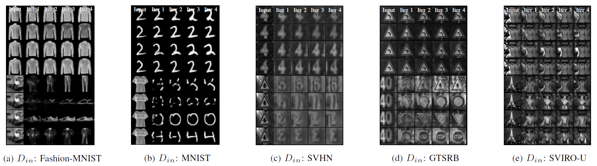

# Autoencoder Attractors for Uncertainty Estimation

This repository is the official PyTorch implementation of [Autoencoder Attractors for Uncertainty Estimation](https://sviro.kl.dfki.de/). 



If you want to cite this work, please use the following bibtex entry:

```
@INPROCEEDINGS{DiasDaCruz2022Uncertainty,
  author = {Steve {Dias Da Cruz} and Bertram Taetz and Thomas Stifter and Didier Stricker},
  title = {Autoencoder Attractors for Uncertainty Estimation},
  booktitle = {Proceedings of the IEEE International Conference on Pattern Recognition (ICPR)},
  year = {2022}
} 
```

## Requirements

To install requirements:

```setup
pip3 install -r requirements.txt
```

## Downloads

The datasets need to be downloaded manually.
Place the datasets inside a folder of your choice. Then define the root path to all the datasets inside `dataset.py`:
```
ROOT_DATA_DIR = Path("")
```
Potentially, you need to adapt the folder name of the downloaded datasets to match the names used inside `dataset.py`.
When you run a training script for a dataset for the first time, then the script will perform a pre-processing to center crop and resize the images to 64 pixels and save them alongside the original images.


## Training

The hyperparameters for the different training approaches for the different models are defined in config files located in the cfg folder.
Modify the hyperparameters accordingly to which approach you want to use during training. 
Then, inside `train_ae.py` or `repeat_train_ae.py` modify which config file to load, e.g.:
```
config = toml.load("cfg/dropout_cae.toml")
```
Finally, to train the model using the defined config file, run one of those commands:

```
python3 train_ae.py
```

```
python3 repeat_train_ae.py
```

`repeat_train_ae.py` will repeat the same experiment using the same hyperparameters for the different seeds defined inside the files respectively.
The config files are self-explanatory and provide the necessary information to reproduce the results of our paper. We provide config files for the most important experiments in the config folder.


## Evaluation

Evaluation needs to be performed by chaining a few scripts after another.
All the experiments, which you want to evaluate, need to be located inside the results folder.

If you want to evaluate your model on all (or a subset of all) datsets, you can use `eval_ae.py` or `eval_ensemble.py`, depending on whether you want to evaluate an autoencoder approach or an ensemble of models.
In either case, the results will be saved inside the experiment folder, such that you can use it later using `calculate_latex_row_performance.py`.
Put the experiment folder names inside the script and run

```
python3 eval_ae.py
```
```
python3 eval_ensemble.py
```

You can then use `calculate_latex_row_performance.py` to compute the mean and standard deviation performance on all datasets.
Moreoever, the results will be printed such that it can be copy-pasted into latex.
Again, you need to specify inside the scripts which experiments to consider and run

```
python3 calculate_latex_row_performance.py
```

If you want to reproduce the entropy plot of our paper, you need to use `plot_entropy.py`

```
python3 plot_entropy.py
```

## Miscellaneous

Regarding the remaining scripts inside this repository, we provide some small explanations:

| Script                        | Training dataset                                                                              | 
|------------------------------ | ----------------------------------------------------------------------------------------------| 
| model.py                      | Autoencoder model architecture definitions                                                    | 
| dataset.py                    | Dataloader for the different datasets                                                         | 
| utils.py                      | A few helperfunctions                                                                         | 

## Contributing

All contributions are welcome! All content in this repository is licensed under the MIT license.

## Acknowledgment

Steve Dias Da Cruz and the work presented in this repository were supported by the Luxembourg National Research Fund (FNR) under grant number 13043281. This work was partially funded by the Luxembourg Ministry of the Economy (CVN 18/18/RED).